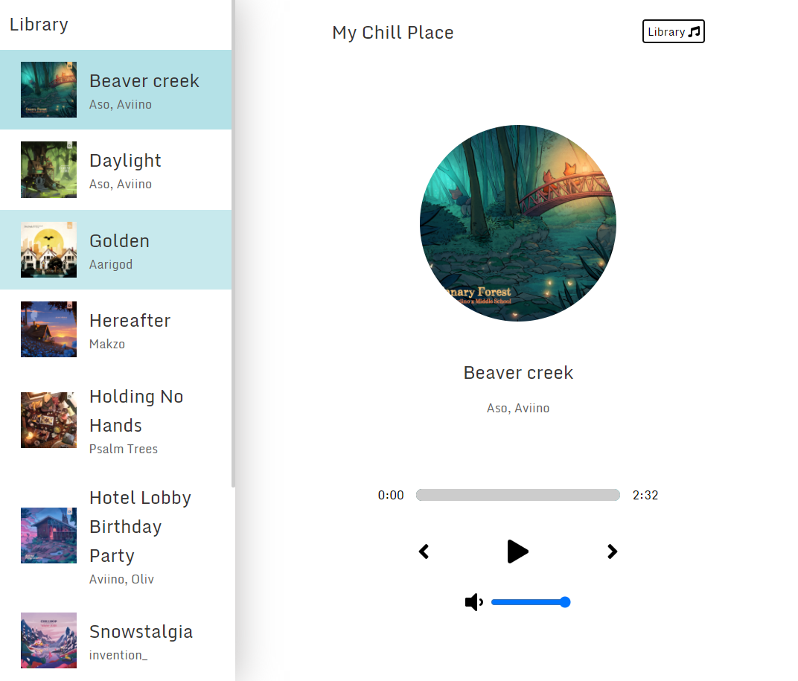

# React Music Player - My Chill Place
## Live Link
https://pawior.github.io/React-Music-Player-My-Chill-Place/
## Table of contents
* [General info](#general-info)
* [How does it looks like?](#how-does-it-looks-like?)
* [Technologies](#technologies)
* [Sources](#sources)

## General info
Music Player written using React. Simple, but with some nice visual effects. Songs were taken from Chillhop.com. Webiste is responsive and ready to work with smartphones.
Music Player has got sleep mode feature which allow users to choose time period after which music will turn off. It could be very helpful while trying to sleep.
## How does it looks like?
	
* Live update
## Technologies
Project is created with:
* HTML5
* CSS
* JavaScript
* React

## Sources
https://chillhop.com/

